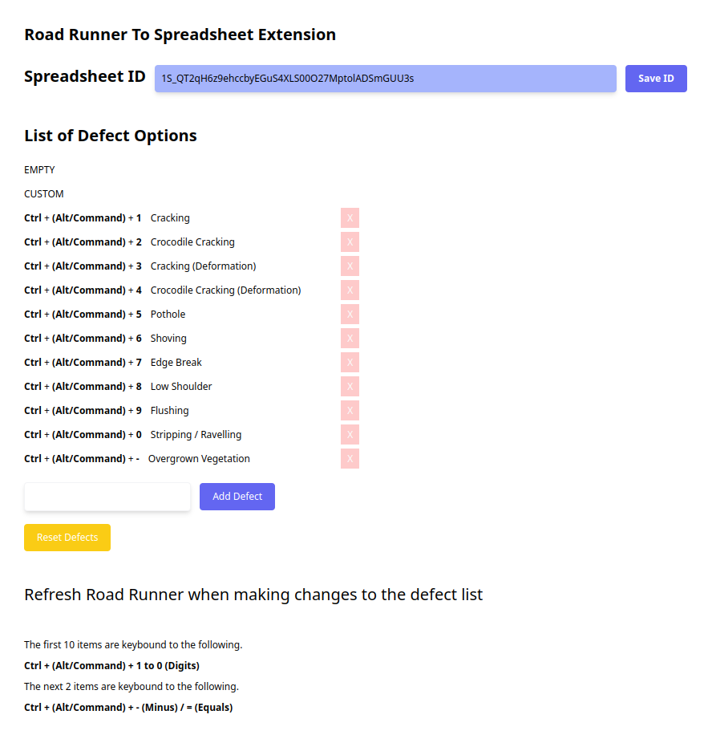

# RR-Enhancer

Chrome Extension Plugin for RoadRunner

## Build

`npm run build`

## Load Unpacked Extension

In developer mode

`chrome://extensions/` -> Load Unpacked -> `./dist`

## Server Host URL (./static/content.ts - Line:432)

http://localhost:5000/api/v1/spreadsheet/append

## Google Spreadsheet Permissions

Add Service Account Email to Spreadsheet with Editor Permissions

## Extension Options

## Demo

[!(Demo)](./rrts.webm)